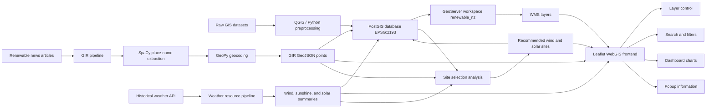

# System Architecture

## Components

- Frontend: Leaflet, HTML5, CSS3, JavaScript, Chart.js.
- Spatial services: GeoServer WMS backed by PostGIS tables.
- Database: PostgreSQL/PostGIS with EPSG:2193 geometry.
- GIR: Python scraping, SpaCy NER, GeoPy geocoding, GeoJSON export.
- Weather resources: Python API collection for historical wind speed, gusts, sunshine duration, and solar radiation.
- Analysis: QGIS/Python multi-criteria suitability workflow and candidate site ranking.

## Data Flow

1. Raw GIS layers are processed in QGIS or Python.
2. Suitability outputs are loaded into PostGIS using EPSG:2193.
3. GeoServer publishes PostGIS tables as WMS layers.
4. The frontend consumes WMS layers and local GeoJSON fallback data.
5. GIR extracted points are exported to GeoJSON and loaded into PostGIS and Leaflet.
6. Historical weather resource summaries are exported to CSV/GeoJSON and loaded into PostGIS and Leaflet.
7. The site selection model ranks candidate wind and solar sites from resource, grid, and GIR evidence.
